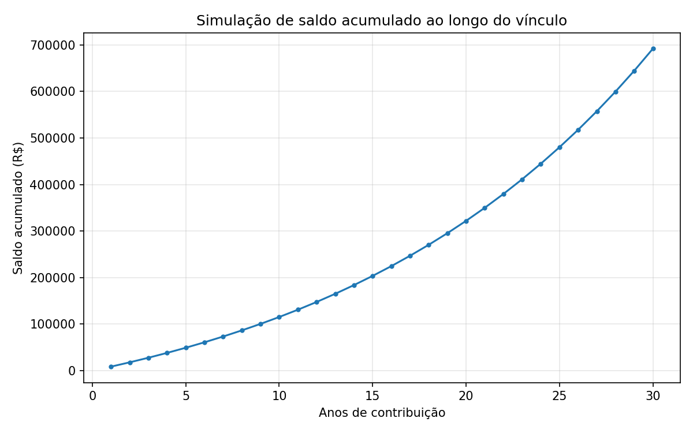
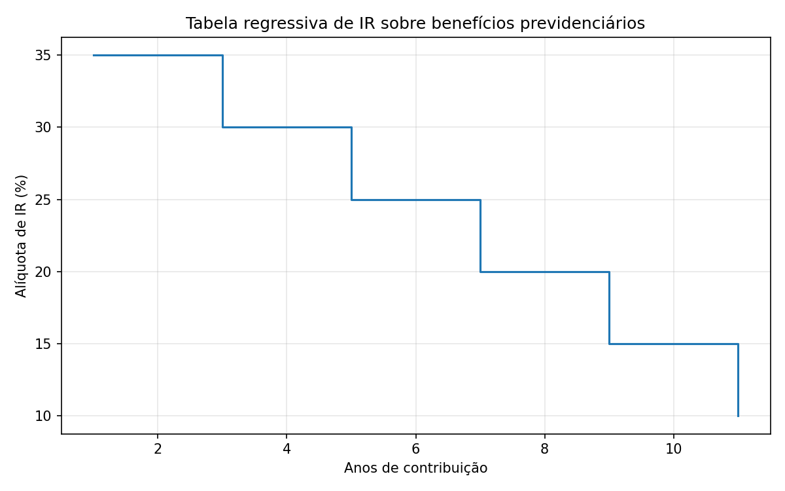

# EFPC Benefits Simulator

Calculation utilities and a small simulation for closed complementary pension
funds (**EFPC** – Entidade Fechada de Previdência Complementar), the Brazilian
equivalent of a corporate closed pension fund, regulated by **PREVIC** under
**LC 109/2001**.

Most EFPC plans in Brazil follow a CD/CV (Contribuição Definida / Contribuição
Variável) structure: participants contribute a percentage of salary above a
reference threshold, the sponsoring company matches part of it, and the
accumulated balance funds the participant's future benefit. This project
models that structure end-to-end: contribution calculation, retirement
eligibility, portability, the regressive income tax table applied to benefit
withdrawals, and a long-horizon balance growth simulation.

## What it calculates

- **Contribution split** – participant contribution (1% flat below the UR
  threshold + a chosen percentage above it) and the sponsor's matching
  contribution, capped at a configurable percentage.
- **Retirement eligibility** – normal retirement (55+, 5+ years of service)
  vs. early retirement (45+, 5+ years of service).
- **Portability** – whether the minimum vesting period (typically 3 years)
  has been met.
- **Income tax rate** – the regressive table applied to benefit payments,
  from 35% down to 10% as the contribution matures past 10 years.
- **Balance growth simulation** – monthly compounding of contributions over
  a working career, given a fixed annual return assumption.

## Example output

```
=== Cenário de exemplo ===
Salário: R$ 8,000.00 | Contribuição escolhida: 5.0%
Contribuição do participante: R$ 360.00
Contrapartida da patrocinadora: R$ 350.00
Contribuição total mensal: R$ 710.00
Elegibilidade (6 anos, 47 anos de idade): elegivel_antecipada
Portabilidade liberada: True
Alíquota de IR aplicável: 25%
```




## Scope and limitations

This is an educational/portfolio project, not a production actuarial tool.
Real conversion of an accumulated balance into a monthly benefit requires a
certified actuary and a biometric (mortality) table — that calculation is
intentionally out of scope here. What's modeled is the operational layer:
the rule-based calculations (contribution, eligibility, tax bracket,
portability) that sit on top of the actuarial layer.

## Running it

```bash
pip install -r requirements.txt
python simulate.py     # prints an example scenario and generates the charts
pytest tests/          # runs the test suite
```

## Stack

Python, matplotlib, pytest.
